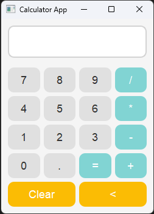

# Description
Python is a versatile and powerful language that offers several development possibilities, such as web projects, backend, desktop, data analysis, Machine Learning, and task automation. These projects were part of a Python learning journey, focusing on developing desktop applications using the PyQt5 library.

## Projects
Below are some projects already developed
- **Calculator**: A simple calculator can perform basic calculations, such as addition, subtraction, multiplication, and division, clear the screen, and delete the last digit. If an error occurs, a window will be displayed informing the reason for the error.

## Objects Used
Below are some of the main objects and components used in the project:
- **QApplication**: *The main object managing the application lifecycle and events, handling initialization, shutdown, and user   interactions.*
- **QMainWindow**: *The application's main window, where all visual elements are placed.*
- **QWidget**: *A generic widget used to group other widgets.*
- **QVBoxLayout / QHBoxLayout**: *Layout managers to organize widgets within the window.*
- **QPushButton**: *Interactive buttons for each number and operation in the calculator.*
- **QLineEdit**: *Text input field to display numbers and calculator results.*
- **QApplication**: *The object responsible for managing the application loop and events.*
- **QPushButton**: *An interactive button for triggering specific actions in the GUI.*
- **QLineEdit**: *A text input field for capturing or displaying user input.*

## Technologies Used

- **Python**: *Programming language.*
- **PyQt5**: *Library for building graphical user interfaces.*
- **QSS**: *For interface styling.*

## Images
 
## Contribution
Contributions are welcome! Feel free to open an issue or submit a pull request with improvements and fixes.

## License
This project is licensed under the MIT License.
